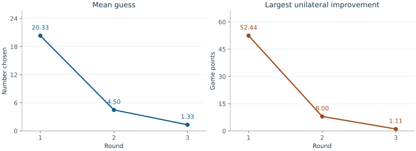

# Two Thirds of the Average {.unnumbered}

The target in this game depends on the numbers chosen by the players. To
choose well, a player must think about what the others will choose and how
they will reason. The game provides a concrete connection between the
normal-form model, best responses, dominance, and Nash equilibrium introduced
in the textbook.

This chapter analyses the *distance-payoff version* played in class, then
examines the recorded choices of six players over three rounds. The mean
guess moved from approximately $20.33$ to $4.50$ to $1.33$. This is movement
toward the zero equilibrium, although none of the three observed profiles
was an equilibrium and the number of exact zero choices actually decreased.

## Rules and classroom procedure {#sec-beauty-rules .unnumbered}

Each player privately chooses a real number in $[0,100]$. All guesses are submitted
before any current-round submissions are revealed. The instructor computes
the arithmetic mean of *all* valid guesses and takes two thirds of that mean as the *target*. Every player earns **100 minus their absolute distance from the target**. The objective is to maximize one's own game points.

The classroom procedure used three rounds with $6$ players. In each round, players made their individual choices. After seeing the  guesses, mean, target, and scores, they made
another individual choice and. This repeated until the third round, when the total results were revealed.

The analysis below concerns the **one-round game**. In the three-round
activity, a full strategy would specify choices following possible histories
of feedback and discussion. Repeating the game supplies experience, while it does
not by itself guarantee that play will approach an equilibrium.

### Relation to the beauty-contest game {.unnumbered}

The classic experiment in @nagel1995 awards a fixed prize to the player
closest to the target, divided equally in a tie. That is a different payoff
rule. Continuous payoffs based on absolute distance are studied by
@gueth2002. Our model is is a specialization of their general family.
The best-response here are derived for the
distance payoff and must not be transferred to a winner-only prize rule.

## Normal-form model {#sec-beauty-model .unnumbered}

For $n\ge2$, use the textbook notation

$$
\left(N,(S_i)_{i\in N},(u_i)_{i\in N}\right),
\qquad N=\{1,\ldots,n\},\qquad S_i=[0,100].
$$

The strategy profile space is $\mathbf S=[0,100]^n$. For a profile
$\mathbf s=(s_1,\ldots,s_n)$, write

$$
\bar s=\frac1n\sum_{i\in N}s_i,
\qquad T(\mathbf s)=\frac23\bar s.
$$ 

The utility functions are

$$
u_i(\mathbf s)=100-|s_i-T(\mathbf s)|,
\qquad i\in N.
$$ {#eq-beauty-utility}

This is an infinite, symmetric, non-cooperative, and general-sum
game in normal form. Its rules and payoffs are announced to every player. The model assumes that each player maximizes their own points.

## Best response {#sec-beauty-best-response .unnumbered}

Fix $i\in N$ and an opponents' profile $\mathbf s_{-i}$. Let

$$
A_{-i}=\sum_{j\ne i}s_j.
$$

Expanding the term in the absolute value in @eq-beauty-utility gives

$$
\begin{aligned}
s_i-T(\mathbf s)
&=s_i-\frac{2}{3n}(s_i+A_{-i})\\
&=\frac{3n-2}{3n}s_i-\frac{2}{3n}A_{-i}\\
&=\frac{3n-2}{3n}
  \left(s_i-\frac{2A_{-i}}{3n-2}\right).
\end{aligned}
$$

Define

$$
r_i(\mathbf s_{-i})=\frac{2A_{-i}}{3n-2}.
$$

The payoff can therefore be written as

$$
u_i(\mathbf s)
=100-\frac{3n-2}{3n}|s_i-r_i(\mathbf s_{-i})|.
$$ 

The coefficient is positive, so the unique maximum occurs at $s_i=r_i(\mathbf s_{-i})$,
provided this number is feasible. It is feasible because

$$
0\le r_i(\mathbf s_{-i})
\le100\frac{2(n-1)}{3n-2}<100.
$$

Following the set-valued definition in @eq-best-response, the best-response is unique, so that 

$$
\operatorname{BR}_i(\mathbf s_{-i})
=r_i(\mathbf s_{-i})=\frac{2}{3n-2}\sum_{j\ne i}s_j.
$$ {#eq-beauty-br}

Every such response earns 100 points.
Writing $\bar s_{-i}=A_{-i}/(n-1)$ and

$$
q=\frac{2(n-1)}{3n-2},
$$

we also have $\operatorname{BR}_i(\mathbf s_{-i})=q\bar s_{-i}$, where $q < 2/3$, although $q$ approaches $2/3$ as $n$ grows.

::: {.callout-note appearance="minimal" icon="false" title="Example: six players"}

With $n=6$, the exact formulas are

$$
q=\frac58,
\qquad
\operatorname{BR}_i(\mathbf s_{-i})
=\frac18\sum_{j\ne i}s_j.
$$

If the five opponents all choose 50, their sum is 250. The best response is
$250/8=31.25$. The resulting mean is $281.25/6=46.875$, and its two-thirds
target is exactly $31.25$. Multiplying the opponents' mean by $2/3$ would
instead give $33\frac13$, which neglects the player's effect on the mean.

:::

## Nash equilibrium {#sec-beauty-equilibrium .unnumbered}

::: {.callout-note appearance="minimal" icon="false" title="Proposition"}

The unique pure-strategy Nash equilibrium of the game is
$\mathbf s^*=(0,\ldots,0)$. 

:::

*Proof.* Clearly, when all opponents choose zero, the choice zero gives 100
points to player $i$. Any deviation to $0< t_i\leq 100$ gives

$$
u_i(t_i,\mathbf0_{-i})
=100-\left(1-\frac{2}{3n}\right)t_i<100.
$$

Thus no unilateral deviation is profitable. Conversely, at a Nash equilibrium, each player must choose their unique best
response in @eq-beauty-br:

$$
s_i^*=\frac23\bar s^*\qquad\text{for every }i\in N.
$$

Averaging these equalities yields

$$
\bar s^*=\frac23\bar s^*,
\qquad\text{so}\qquad \bar s^*=0.
$$

Consequently every $s_i^*$ equals zero.  $\square$

Note that the zero is not a weakly dominant strategy. Against opponents all choosing 50, the unique best response is the positive
number $50q$. Choosing zero instead gives

$$
u_i(0,50,\ldots,50)=100-\frac{100(n-1)}{3n}<100.
$$

There is no weakly dominant
strategy at all. Indeed, only zero is optimal against all-zero opponents, whereas zero is not optimal against all-50 opponents. 

## Why two thirds rather than the average? {#sec-beauty-multiplier .unnumbered}

Replace the multiplier $2/3$ by $p$. For $0<p<1$, on the same strategy sets $[0,100]$ the analogous
calculation gives 
$$
\operatorname{BR}_i(\mathbf s_{-i})
=\frac{p}{n-p}\sum_{j\ne i}s_j,
\qquad q_p=\frac{p(n-1)}{n-p}<1.
$$ 

The unique equilibrium remains all zero. Thus two thirds is a convenient conventional choice and its particular
value is not essential for these conclusions.

If $p=1$, players try to match the average itself. The best-response set is
then the singleton containing the opponents' average. Therefore, *every unanimous
profile* $(c,\ldots,c)$, $c\in[0,100]$, is a pure Nash equilibrium. These
are all the pure equilibria, because equilibrium requires $s_i=\bar s$ for
every $i$.

Agreement on a positive number creates an incentive to move
lower for $p<1$. For example, a conjectured opponents' mean of 50 leads to roughly 33, then
22, then 15 under successive large-population reasoning with $p=2/3$;
with $p=1$ the corresponding anchor stays at 50.
 

## Changing the strategy interval {#sec-beauty-interval .unnumbered}

Now suppose every player has the same compact strategy interval
$S_i=[a,b]$, where $a<b$, and the target is still $p\bar s$ with $0<p<1$.
The payoff remains $100-|s_i-p\bar s|$, but this score can be negative. Changing the additive
constant 100 would not change any best response or equilibrium.

### A constrained best response {.unnumbered}

The unconstrained ideal strategy is still

$$
r_i(\mathbf s_i)=\frac{p}{n-p}\sum_{j\ne i}s_j
=q_p\bar s_{-i},
$$

but it may now lie outside the feasible interval. Define the projection

$$
\Pi_{[a,b]}(x)=\min\{b,\max\{a,x\}\}.
$$

Maximizing utility now means choosing the feasible strategy nearest to $r_i$:

$$
\operatorname{BR}_i(\mathbf s_{-i})
=\Pi_{[a,b]}
\left(\frac{p}{n-p}\sum_{j\ne i}s_j\right).
$$ {#eq-beauty-projected-br}

### The equilibrium is the feasible point nearest zero {.unnumbered}

::: {.callout-note appearance="minimal" icon="false" title="Proposition"}

Let $c=\Pi_{[a,b]}(0)$. The unique Nash equilibrium in pure strategies is $(c,\ldots,c)$:

| Strategy interval | Equilibrium choice of every player |
|:---:|:---:|
| $0\in[a,b]$ | $0$ |
| $0<a<b$ | $a$ |
| $a<b<0$ | $b$ |

:::

*Proof.*  We will introduce this simplified notation first. Let $F(\mathbf s)$ be the right-hand side of
@eq-beauty-projected-br. At the unanimous profile $\mathbf s=(c,\ldots,c)$, we get $F(\mathbf s)=\Pi_{[a,b]}(q_pc)=c$, so this profile is an equilibrium.

Projection onto an interval cannot increase distances of the arguments. Therefore, for any
two profiles $\mathbf s,\mathbf t$,

$$
\begin{aligned}
|F_i(\mathbf s)-F_i(\mathbf t)|
&\le\frac{p}{n-p}\sum_{j\ne i}|s_j-t_j|\\
&\le q_p\|\mathbf s-\mathbf t\|_\infty,
\end{aligned}
$$

where $\|\mathbf s-\mathbf t\|_\infty=\max_i|s_i-t_i|$. If both profiles
were equilibria, they would be fixed points of $F$, yielding

$$
\|\mathbf s-\mathbf t\|_\infty
\le q_p\|\mathbf s-\mathbf t\|_\infty.
$$

Since $q_p<1$, this forces $\mathbf s=\mathbf t$. $\square$

## The six-player classroom record {#sec-beauty-record .unnumbered}

The following analysis contains six valid submissions in each of three rounds.

### Choices  {.unnumbered}

| Player | Round 1 guess | Round 2 guess | Round 3 guess |
|---|---:|---:|---:|
| P01 | 28 | 11 | 1 |
| P02 | 1 | 1 | 2 |
| P03 | 0 | 3 | 1 |
| P04 | 66 | 0 | 1 |
| P05 | 0 | 3 | 2 |
| P06 | 27 | 9 | 1 |

### Observed scores  {.unnumbered}

| Player | Round 1 score | Round 2 score | Round 3 score |
|---|---:|---:|---:|
| P01 | 85.5556 | 92 | 99.8889 |
| P02 | 87.4444 | 98 | 98.8889 |
| P03 | 86.4444 | 100 | 99.8889 |
| P04 | 47.5556 | 97 | 99.8889 |
| P05 | 86.4444 | 100 | 98.8889 |
| P06 | 86.5556 | 94 | 99.8889 |

We summarizes the results across the three rounds using selected statistics.

| Statistic | Round 1 | Round 2 | Round 3 |
|:---|---:|---:|---:|
| Sum | $122$ | $27$ | $8$ |
| Mean | $61/3\approx20.3333$ | $9/2=4.5$ | $4/3\approx1.3333$ |
| Target | $122/9\approx13.5556$ | $3$ | $8/9\approx0.8889$ |
| Smallest and largest guess | $0,66$ | $0,11$ | $1,2$ |
| Number of zero guesses | $2$ | $1$ | $0$ |
| Mean score | $80$ | $581/6\approx96.8333$ | $896/9\approx99.5556$ |

: Round summaries computed from the recorded guesses. {#tbl-beauty-summary tbl-colwidths="[31,23,23,23]"}

### Measuring the remaining incentive to deviate {#sec-beauty-regret .unnumbered}

Define player $i$'s **unilateral improvement** at the observed profile as

$$
\begin{aligned}
R_i(\mathbf s)
&=\max_{t_i\in S_i}
  \bigl[u_i(t_i,\mathbf s_{-i})-u_i(\mathbf s)\bigr]\\
&=100-u_i(\mathbf s).
\end{aligned}
$$

The second equality holds here because a feasible best response always
earns 100 points. The maximum improvement

$$
\varepsilon(\mathbf s)=\max_i R_i(\mathbf s)
$$

is zero exactly at a Nash equilibrium. More generally, a profile is an
**$\varepsilon$-Nash equilibrium** if no player can improve their utility by
more than $\varepsilon$. For each recorded round we get

$$
\varepsilon(\mathbf s^{(1)})=472/9\approx52.4444,
\qquad \varepsilon(\mathbf s^{(2)})=8,
\qquad \varepsilon(\mathbf s^{(3)})=10/9\approx1.1111.
$$

Thus the final profile is a $10/9$-Nash equilibrium in the stated score
units, but not an exact Nash equilibrium. This quantifies the remaining
incentive to deviate. 

{#fig-beauty-results fig-alt="The mean guess decreases from 20.33 to 4.5 to 1.33. The maximum available unilateral score improvement decreases from 52.44 to 8 to 1.11. Neither series reaches zero." width=100%}

For completeness, the exact ex post best responses in all rounds are:

| Player | Round 1 best response | Round 2 best response | Round 3 best response |
|---|---:|---:|---:|
| P01 | $47/4$ | $2$ | $7/8$ |
| P02 | $121/8$ | $13/4$ | $3/4$ |
| P03 | $61/4$ | $3$ | $7/8$ |
| P04 | $7$ | $27/8$ | $7/8$ |
| P05 | $61/4$ | $3$ | $3/4$ |
| P06 | $95/8$ | $9/4$ | $7/8$ |

These are retrospective comparisons with the *realized* opponents'
choices fixed. Players did not observe those choices when submitting, so
an ex post improvement does not by itself establish an unreasonable prior
belief or an irrational decision.

### What the record supports {.unnumbered}

The mean guess and the maximum guess both decrease, so the observed profiles
move closer to $(0,\ldots,0)$ in both average and maximum absolute distance.
The spread also narrows, from the observed range $[0,66]$ to $[1,2]$.
Meanwhile, the mean and maximum unilateral improvements decrease sharply.
These are complementary signs of movement toward equilibrium over the
three observed rounds.

The number of exact equilibrium actions, however, falls from two to one to
zero. Counting zero guesses would miss the aggregate movement. Individual
paths are heterogeneous: P01 and P06 decrease throughout, P02 finishes above
their initial choice, and P03 and P05 first leave zero. These patterns show why
the analysis should examine whole profiles and incentives, rather than
assigning a reasoning level to a single number.

