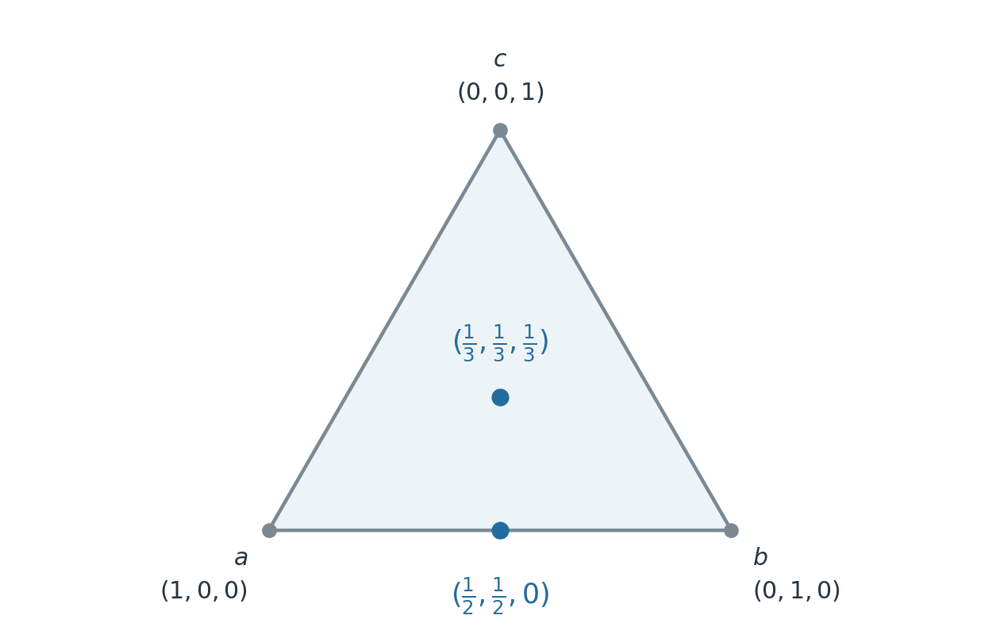

## Why randomize?

In [the previous chapter](01-strategic-games.qmd), matching pennies and the
household-chores game had no pure-strategy Nash equilibrium. At every pure
profile, someone could improve their payoff by changing their choice. This
does not mean that these games have no equilibrium once players can randomize.
It means that a fixed choice of a pure strategy may be too restrictive.

In matching pennies, a predictable choice can be exploited. A probability
distribution over heads and tails allows a player to specify how they will
randomize without making the realized choice predictable. The relevant
question becomes: can the players choose distributions such that neither
benefits from changing their own distribution?

This chapter develops the definitions and mathematical conditions needed to
answer that question. Throughout, the normal-form game
$\left(N,(S_i)_{i\in N},(u_i)_{i\in N}\right)$ is *finite*, that is, every $S_i$ is a finite strategy set. We retain
$\mathbf S=\prod_{i\in N}S_i$ and the notation $\mathbf s_{-i}$ for the
opponents' pure strategies.

## Mixed strategies and expected utility {#sec-mixed-strategies}

### Probability distributions over pure strategies

::: {.callout-note appearance="minimal" icon="false" title="Definition"}

A **mixed strategy** of player $i$ is a probability distribution $p_i$ on
$S_i$. The set of mixed strategies is

$$
\Delta_i=\left\{p_i:S_i\to[0,1]\;\middle|\;
\sum_{s_i\in S_i}p_i(s_i)=1\right\}.
$$

A **mixed-strategy profile** is
$\mathbf p=(p_1,\ldots,p_n)\in\boldsymbol\Delta$, where
$\boldsymbol\Delta=\prod_{i\in N}\Delta_i$.

:::

A player first selects a distribution and then draws a pure strategy according
to it. The draws of different players are **independent**. Thus the probability
of the pure profile $\mathbf s$ is

$$
\prod_{i\in N}p_i(s_i).
$$

 Randomization does not require repeated play,
although repeated independent draws make its frequencies easier to observe.

We identify a pure strategy $s_i$ with the distribution assigning probability
$1$ to $s_i$ and $0$ otherwise. Consequently, pure strategies are
special cases of mixed strategies. For example, if $S_i=\{H,T\}$, a mixed strategy can be
written as $(p,1-p)$, with $0\le p\le1$. The endpoints are pure strategies. For $S_i=\{a,b,c\}$, the set $\Delta_i$ is a triangle, namely the **probability
simplex** in @fig-mixed-simplex. Its vertices are pure strategies. Every edge
contains distributions using at most two pure strategies. More generally, for
$|S_i|=m$, the simplex has dimension $m-1$.

{#fig-mixed-simplex width=85% fig-alt=""}

### Expected utility

A rational player seeks
to maximize expected utility. 

::: {.callout-note appearance="minimal" icon="false" title="Definition"}

The **expected utility** of player $i$ at a mixed profile $\mathbf p$ is

$$
U_i(\mathbf p)
=\sum_{\mathbf s\in\mathbf S}
u_i(\mathbf s)\prod_{j\in N}p_j(s_j).
$$ {#eq-mixed-expected-utility}

:::

We use the following notation: lowercase $u_i$ evaluates a pure profile and uppercase $U_i$ evaluates a mixed
profile. In particular, against opponents' distributions $\mathbf p_{-i}$,
the expected utility of a pure strategy $s_i$ is

$$
U_i(s_i,\mathbf p_{-i})
=\sum_{\mathbf s_{-i}\in\mathbf S_{-i}}
u_i(s_i,\mathbf s_{-i})\prod_{j\ne i}p_j(s_j).
$$

Regrouping ([-@eq-mixed-expected-utility]) by player $i$'s choice gives the identity
used throughout this chapter:

$$
U_i(p_i,\mathbf p_{-i})
=\sum_{s_i\in S_i}p_i(s_i)U_i(s_i,\mathbf p_{-i}).
$$ {#eq-mixed-weighted-average}

For fixed opponents' strategies, a player's expected utility is a weighted
average of the utilities of their pure strategies. In particular, it is linear
in that player's own probabilities. 

:::: {.callout-note appearance="minimal" icon="false"}

::: {#exm-mixed-expected-example}

Player 1 chooses a row and player 2 chooses a column:



Let $p=p_1(a)$, $q=p_2(x)$, and $r=p_2(y)$. Then
$p_1(b)=1-p$ and $p_2(z)=1-q-r$. The expected utilities are

$$
\begin{aligned}
U_1(p_1,p_2)
&=pq+pr+3p(1-q-r)+2(1-p)q,\\
U_2(p_1,p_2)
&=7pq+5pr+4p(1-q-r)\\
&\quad+3(1-p)q+4(1-p)r+6(1-p)(1-q-r).
\end{aligned}
$$

For player 1, the same calculation can be organized by pure strategies:

$$
U_1(a,p_2)=q+r+3(1-q-r),\qquad U_1(b,p_2)=2q,
$$

and $U_1(p_1,p_2)=pU_1(a,p_2)+(1-p)U_1(b,p_2)$.
We return to this game in @sec-mixed-support-condition to see why an equilibrium
may assign probability zero to some pure strategy.
:::
:::

## Nash equilibrium and best responses {#sec-mixed-nash-definition}

::: {.callout-note appearance="minimal" icon="false" title="Definition"}

A mixed-strategy profile $\mathbf p^*\in\boldsymbol\Delta$ is a
**Nash equilibrium** if, for every player $i\in N$,

$$
U_i(\mathbf p^*)
\ge U_i(p_i,\mathbf p_{-i}^*)
\qquad\text{for every }p_i\in\Delta_i.
$$

:::

The comparison holds the opponents' distributions fixed. A deviation may
change any of player $i$'s probabilities, including replacing randomization
by a pure strategy. Equilibrium rules out a *strictly profitable* deviation.

### The best-response correspondence

For fixed $\mathbf p_{-i}$, define

$$
\operatorname{BR}_i(\mathbf p_{-i})
=\underset{p_i\in\Delta_i}{\operatorname{argmax}}
U_i(p_i,\mathbf p_{-i}).
$$

The set-valued map $\operatorname{BR}_i$ is the **best-response correspondence**.
Its value $\operatorname{BR}_i(\mathbf p_{-i})$ is the set of mixed strategies of player $i$ that are best
responses to $\mathbf p_{-i}$. Directly from the
definitions,

$$
\mathbf p^*\text{ is a Nash equilibrium}
\quad\Longleftrightarrow\quad
p_i^*\in\operatorname{BR}_i(\mathbf p_{-i}^*)
\text{ for every }i\in N.
$$

### Why pure strategies suffice to test Nash equilibrium {#sec-mixed-pure-deviations}

Although there are infinitely many mixed strategies, there are
only finitely many pure strategies to test if a given mixed strategy profile is an equilibrium.

::: {.callout-important appearance="minimal" icon="false" title="Proposition"}

A profile $\mathbf p^*$ is a Nash equilibrium if and only if, for every
player $i$ and every $s_i\in S_i$,

$$
U_i(\mathbf p^*)\ge U_i(s_i,\mathbf p_{-i}^*).
$$

:::

*Proof.* Necessity follows because pure strategies are mixed strategies.
Conversely, suppose all the displayed inequalities hold. For any mixed
strategy $p_i$, ([-@eq-mixed-weighted-average]) gives

$$
\begin{aligned}
U_i(p_i,\mathbf p_{-i}^*)
&=\sum_{s_i\in S_i}p_i(s_i)U_i(s_i,\mathbf p_{-i}^*)\\
&\le\sum_{s_i\in S_i}p_i(s_i)U_i(\mathbf p^*)
=U_i(\mathbf p^*).
\end{aligned} 
$$
$\square$

## Existence of equilibrium {#sec-mixed-existence}

::: {.callout-important appearance="minimal" icon="false" title="Nash's theorem [@nash1951]"}

Every finite normal-form game has at least one equilibrium in mixed
strategies.

:::

The proof uses a
fixed-point theorem. We use the existence result here without reproducing
that proof. Several qualifications matter. A mixed strategy includes a pure strategy,
so the theorem does not assert that some player must randomize. It provides only an existence guarantee. The methods for finding an
equilibrium belong to the later topic on computing Nash equilibrium.

## Supports and indifference {#sec-mixed-supports}

::: {.callout-note appearance="minimal" icon="false" title="Definition"}

The **support** of a mixed strategy $p_i$ is the set of pure strategies

$$
\operatorname{spt}(p_i)=\{s_i\in S_i\mid p_i(s_i)>0\}.
$$

The mixed strategy is **completely mixed** if its support is $S_i$.
A profile $(p_1,\dots,p_n)$ is completely mixed if every  $p_i$ is.

:::

For example, let $S_i=\{a,b,c\}$ and $p_i(a)=p_i(b)=p_i(c)=\frac 13$, then $p_i$ is completely mixed. Another mixed strategy $q_i(a)=q_i(b)=\frac 12$ has support $\operatorname{spt}(q_i)=\{a,b\}$. A pure strategy has a one-element support.

### The indifference principle {#sec-mixed-indifference}

::: {.callout-important appearance="minimal" icon="false" title="Proposition"}

At a Nash equilibrium $\mathbf p^*$, every pure strategy
$s_i\in\operatorname{spt}(p_i^*)$ gives player $i$ the same expected utility:

$$
U_i(s_i,\mathbf p_{-i}^*)=U_i(\mathbf p^*).
$$

In particular, any two pure strategies in the support have equal expected
utilities against the equilibrium opponents' strategies.

:::

*Proof.* Suppose $s_i,t_i\in\operatorname{spt}(p_i^*)$ and
$U_i(s_i,\mathbf p_{-i}^*)>U_i(t_i,\mathbf p_{-i}^*)$.
Transfer all probability assigned to $t_i$ to $s_i$, leaving the other
probabilities unchanged. Specifically, define:

$$
p_i(a)=
\begin{cases}
0,&a=t_i,\\
p_i^*(s_i)+p_i^*(t_i),&a=s_i,\\
p_i^*(a),&a\notin\{s_i,t_i\}.
\end{cases}
$$

This is a mixed strategy. Its improvement in expected utility is

$$
U_i(p_i,\mathbf p_{-i}^*)-U_i(\mathbf p^*)
=p_i^*(t_i)\bigl[U_i(s_i,\mathbf p_{-i}^*)
-U_i(t_i,\mathbf p_{-i}^*)\bigr]>0,
$$

contradicting equilibrium. Therefore the utilities on the support are equal.
Their weighted average is $U_i(\mathbf p^*)$, so their common value must be
that expected utility. $\square$

The reason for mixing is therefore not that a weighted average improves on
the best pure reply. *A player mixes among equally good replies, and the
chosen probabilities in turn affect the opponents' incentives.*

::: {.callout-note appearance="minimal" icon="false" title="Example: Indifference is not sufficient"}

Player 1 chooses a row and
player 2 chooses a column in the following $3\times2$ game:



Suppose player 1 uses only $a,b$, with probabilities $p,1-p$, and player 2
uses $l,r$, with probabilities $q,1-q$. Indifference within these proposed
supports requires

$$
\begin{aligned}
U_1(a,p_2)=q&=1-q=U_1(b,p_2),\\
U_2(p_1,l)=1-p&=p=U_2(p_1,r).
\end{aligned}
$$

Thus $p=q=1/2$, giving the candidate profile

$$
p_1=(1/2,1/2,0),\qquad p_2=(1/2,1/2),
$$

with coordinates ordered as $(a,b,c)$ and $(l,r)$. Every strategy in each
player's support gives that player expected utility $1/2$. Nevertheless,
player 1 can switch to the unused strategy $c$ and obtain

$$
U_1(c,p_2)=0.6>\frac12=U_1(p_1,p_2).
$$

The candidate mixed strategy is therefore *not a Nash equilibrium*. 

:::

In conclusion, indifference among strategies in the support is *necessary but not
sufficient* for equilibrium: we must also check that no strategy outside
the support gives a higher payoff. 

### The support characterization {#sec-mixed-support-condition}

Indifference among used pure strategies is necessary for an equilibrium. The question remains if an unused choice outside the support might
still be better. To state the full condition, distinguish pure from mixed
best responses:

$$
B_i(\mathbf p_{-i})
=\underset{s_i\in S_i}{\operatorname{argmax}}
U_i(s_i,\mathbf p_{-i}).
$$ 

The set $B_i(\mathbf p_{-i})$ consists of pure strategies, whereas $\operatorname{BR}_i(\mathbf p_{-i})$
consists of probability distributions.

::: {.callout-important appearance="minimal" icon="false" title="Proposition"}

A profile $\mathbf p^*$ is a Nash equilibrium if and only if

$$
\operatorname{spt}(p_i^*)\subseteq B_i(\mathbf p_{-i}^*)
\qquad\text{for every }i\in N.
$$ {#eq-support-BR}

Equivalently, condition ([-@eq-support-BR]) says that for every player $i$:

- every choice in the support gives expected utility $U_i(\mathbf p^*)$;
- every choice outside the support gives expected utility at most $U_i(\mathbf p^*)$.

:::

*Proof.* At an equilibrium, indifference identifies the payoff of each used
choice with $U_i(\mathbf p^*)$, and the pure-deviation condition rules out
any higher payoff. Conversely, if every pure strategy in the support is a pure best response,
their weighted average equals the maximum pure-choice payoff. No pure
deviation can improve it, and hence no mixed deviation can improve it.
$\square$

::: {.callout-note appearance="minimal" icon="false" title="Example: An equilibrium with partial support"}

Return to the $2\times3$ game in @exm-mixed-expected-example. Consider mixed strategies

$$
p_1^*=(1/2,1/2),\qquad p_2^*=(3/4,0,1/4),
$$

with coordinates ordered as $(a,b)$ and $(x,y,z)$. Against $p_2^*$,
player 1 obtains

$$
U_1(a,p_2^*)=\frac34+3\cdot\frac14=\frac32,
\qquad
U_1(b,p_2^*)=2\cdot\frac34=\frac32.
$$

Against $p_1^*$, player 2 obtains

$$
U_2(p_1^*,x)=5,\qquad
U_2(p_1^*,y)=\frac92,\qquad
U_2(p_1^*,z)=5.
$$

Both players mix only among best responses, so this profile is a Nash
equilibrium with expected payoffs $(3/2,5)$. Player 2 leaves $y$ unused
because its expected payoff is strictly lower. 

:::

The inclusion ([-@eq-support-BR]) need not be equality: an unused pure strategy outside the support is allowed to
tie with those in the support. If the profile is completely mixed, there are no unused strategies, so indifference for every player is sufficient.

## Two-player $(2\times2)$ examples {#sec-mixed-two-player-examples}

 This case is elementary. Let $p$ and $q$ denote the players’ probabilities of choosing their first strategies. The indifference principle gives two linear equations: solve for $q$ by making the row player indifferent, and for $p$ by making the column player indifferent. If $0<p,q<1$, they define a completely mixed strategy profile and hence an equilibrium.

 

::: {.callout-note appearance="minimal" icon="false" title="Example: Matching pennies"}

Alice chooses the row and wants the coins to match; Bob chooses the column
and wants them to differ:



Let $p=\Pr(\text{Alice chooses }H)$ and
$q=\Pr(\text{Bob chooses }H)$. Alice's pure-strategy utilities are

$$
U_A(H,q)=2q-1,\qquad U_A(T,q)=1-2q.
$$

She prefers $H$ when $q>1/2$, prefers $T$ when $q<1/2$, and is indifferent
when $q=1/2$. Bob's utilities are

$$
U_B(p,H)=1-2p,\qquad U_B(p,T)=2p-1,
$$

so he is indifferent when $p=1/2$. At

$$
p^*=q^*=\frac12,
$$

every pure strategy gives its player expected utility $0$. It is the unique equilibrium: if either
player chose a non-uniform distribution, the other would have a unique pure best
response, which would in turn invite a profitable change by the first player.

:::

::: {.callout-note appearance="minimal" icon="false" title="Example: Sharing household chores"}

Alice chooses whether to cook or clean, and Bob chooses whether to shop or
take out the trash. Alice prefers chores that contribute to the same goal;
Bob prefers covering different needs. Their satisfaction scores are:



Let $p=\Pr(\text{Cook})$ and $q=\Pr(\text{Shop})$. Alice's indifference
requires

$$
2q=1-q,\qquad\text{hence }q=\frac13.
$$

Bob's indifference requires

$$
2(1-p)=p,\qquad\text{hence }p=\frac23.
$$

This mixed strategy profile is a unique equilibrium with expected payoffs $(2/3,2/3)$. Notice the direction of the equations: Alice's indifference determines how often *Bob*
shops, and Bob's indifference determines how often *Alice* cooks.

:::

::: {.callout-note appearance="minimal" icon="false" title="Example: Bach or Stravinski"}

Alice prefers Bach and Bob prefers Stravinski, but both prefer attending
together to attending different concerts:



The pure equilibria are $(B,B)$ and $(S,S)$. Let
$p=\Pr(\text{Alice chooses }B)$ and $q=\Pr(\text{Bob chooses }B)$.
For both to mix, Alice must be indifferent between $2q$ and $1-q$, while Bob
must be indifferent between $p$ and $2(1-p)$. Therefore there is also a mixed
equilibrium with

$$
p=\frac23,\qquad q=\frac13,
$$
and the expected utilities are $\left(\frac23,\frac23\right)$. Both pure equilibria give both players more than the mixed equilibrium.
Nevertheless, neither player can improve unilaterally at the mixed profile.

:::

::: {.callout-note appearance="minimal" icon="false" title="Example: Coordination"}

Players independently choose a meeting place. Both prefer meeting at
$a$ to meeting at $b$, and both prefer either meeting to missing one another:



Besides $(a,a)$ and $(b,b)$, there is an equilibrium in which both choose
$a$ with probability $1/3$. Indeed, against that distribution, choosing $a$
gives $2/3$ and choosing $b$ gives $1-1/3=2/3$. The expected payoff pair is $(2/3,2/3)$. 

:::

::: {.callout-note appearance="minimal" icon="false" title="Example: Professor's Dilemma"}

This example is adapted from the *Professor's Dilemma* in Procaccia's lecture slides [@procaccia2016, slide 8]. A professor decides whether to prepare a lecture, while the students,
modelled as one player, decide whether to listen. They choose without
observing the other's decision. A prepared lecture with attentive students
benefits both. Effort without participation costs the player who makes it.



Both $(\text{Prepare},\text{Listen})$ and
$(\text{Slack off},\text{Sleep})$ are pure equilibria. If the students listen
with probability $q$, preparing gives $10^6q-10(1-q)$, while slacking off
gives $0$. The professor is indifferent when

$$
q=\frac{10}{10^6+10}=\frac1{100001}.
$$

The students' analogous indifference condition gives the same probability
for preparation. Hence a completely mixed equilibrium also exists, with
expected payoff $0$ to each player. The very large benefit from successful
coordination does not remove the other equilibria or explain which one will
be played.

:::

## Good Samaritan: Who will provide aid? {#sec-mixed-good-samaritan}

This example is adapted from the *Good Samaritan Game* in Chapter 2 of Binmore's *Game Theory: A Very Short Introduction* [@binmore2007, pp. 25–26]. There are $n\ge2$ bystanders who hear a cry for aid. Each independently
chooses whether to provide aid ($a$) or leave the task to someone else
($\bar a$), without observing the others' choices. Everyone values someone
receiving help at $10$ utility units. Providing aid costs $1$ utility unit,
so a helper receives $9$ regardless of how many others also help. A
non-helper receives $10$ if someone else helps and $0$ if nobody helps.

Thus $S_i=\{a,\bar a\}$ and

$$
u_i(\mathbf s)=
\begin{cases}
9,&s_i=a,\\
10,&s_i=\bar a\text{ and some }j\ne i\text{ chooses }a,\\
0,&\mathbf s=(\bar a,\ldots,\bar a).
\end{cases}
$$

For $n=2$, the game is



### Pure equilibria

There are exactly $n$ pure equilibria, each with *exactly one helper*:

- If nobody helps, any bystander can increase their utility from $0$ to $9$
  by helping.
- If at least two bystanders help, any helper can stop helping and increase
  their utility from $9$ to $10$.
- If exactly one helps, that helper would lose $9$ by stopping, while every
  other bystander would lose $1$ by also helping.

Pure equilibria therefore exist, but they assign different roles to identical players. The model by itself does not select the helper.

### A symmetric mixed equilibrium

We now look for a particular equilibrium in which everyone uses the same distribution.
This is a restriction on the equilibrium we seek, not a consequence that
every equilibrium must satisfy. Let $q$ be each bystander's probability of
*not* helping and $\mathbf p$ be the corresponding strategy profile. Then

$$
U_i(a,\mathbf p_{-i})=9,
\qquad
U_i(\bar a,\mathbf p_{-i})=10\bigl(1-q^{n-1}\bigr).
$$

For both pure strategies to be used with positive probability, indifference requires

$$
9=10\bigl(1-q^{n-1}\bigr),
\qquad
q=(0.1)^{1/(n-1)}.
$$ 

Since $0<q<1$, this gives a completely mixed profile. This shows that the profile is a Nash equilibrium
with

$$
U_i(\mathbf p^*)=9\qquad\text{for every }i\in N.
$$

### The chance that nobody helps

There are $n-1$ other bystanders in an individual's indifference condition,
but there are $n$ bystanders who must all abstain for aid to fail. Consequently,
at the symmetric equilibrium,

$$
\Pr(\text{nobody helps})=q^n=(0.1)^{n/(n-1)}.
$$

| Bystanders $n$ | Each player's probability of helping $1-q$ | Probability nobody helps $q^n$ |
|---:|---:|---:|
| $2$ | $0.900$ | $0.010$ |
| $3$ | $0.684$ | $0.032$ |
| $5$ | $0.438$ | $0.056$ |
| $10$ | $0.226$ | $0.077$ |

: Symmetric equilibrium probabilities, rounded to three decimal places. {#tbl-samaritan-probabilities}

As $n\to\infty$,

$$
q\longrightarrow1,\qquad
1-q\longrightarrow0,\qquad
q^n\longrightarrow0.1.
$$

Each individual becomes less likely to help as the group grows. The chance
of no aid increases toward $10\%$ in this family of symmetric equilibria,
even though there are more potential helpers. This is a consequence of the
specified incentives and independent equilibrium randomization, rather than
an empirical claim about actual emergencies.

