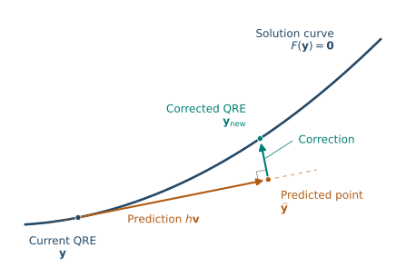

Nash’s theorem guarantees that every finite game has an equilibrium, but it does not tell us how to find one efficiently. Checking a given profile is relatively straightforward. Finding a suitable profile is more demanding. Computing a Nash equilibrium is believed to be computationally difficult in the worst case, even for two-player general-sum games. No polynomial-time algorithm is known. The relevant hardness result is called *PPAD-completeness* [@chen2009]. Unlike NP-hardness, PPAD concerns search problems for which a solution is guaranteed to exist, but finding one may be computationally difficult. We will not need the formal definition of PPAD. As with NP-hardness, the practical message is that we should not expect a general algorithm that efficiently solves every instance, although particular games may be easy and numerical methods can work well in practice.

In this lecture, we take the viewpoint of an analyst who is given the
players, their strategy sets, and all their payoff functions. *The intermediate steps are calculations performed by a solver, rather
than rounds of interaction among the players.* The computational task
requires access to the full game; it does not require the game to be common
knowledge among the players. In the later lecture on learning in games, we
instead study how players adapt their actions over time, making explicit
what each player knows and observes.

 We first use the Nash conditions directly. We then introduce *quantal response
equilibrium* and recover Nash equilibrium as a limit when response
noise vanishes. This leads to a numerical method for computing approximate
Nash equilibria and checking their accuracy.


## Approximate equilibrium {#sec-computing-regret}
Throughout, the normal-form game $\left(N,(S_i)_{i\in N},(u_i)_{i\in N}\right)$ is finite.
We retain the notation $\mathbf S=\prod_i S_i$, $p_i\in\Delta_i$, and
$\mathbf p\in\boldsymbol\Delta$. Lowercase $u_i$ denotes utility at a pure
profile and uppercase $U_i$ denotes expected utility.

A numerical solver returns probabilities with finite precision. Exact equality
of expected utilities is therefore an unsuitable stopping test. A more useful
question is whether a player can still gain a positive utility by changing
their strategy.

::: {.callout-note appearance="minimal" icon="false" title="Definition"}

The **deviation incentive** of player $i$ at a mixed strategy profile
$\mathbf p$ is

$$
\delta_i(\mathbf p)
=\max_{s_i\in S_i}U_i(s_i,\mathbf p_{-i})-U_i(\mathbf p).
$$ {#eq-computing-regret}

The **maximum deviation incentive** of the profile is

$$
\delta(\mathbf p)=\max_{i\in N}\delta_i(\mathbf p).
$$

For $\epsilon\geq0$, a profile $\mathbf p$ is an
**$\epsilon$-Nash equilibrium** if $\delta(\mathbf p)\leq\epsilon$.

:::

The weighted-average identity ([-@eq-mixed-weighted-average]) implies
$\delta_i(\mathbf p)\geq0$. The same identity also shows that no mixed deviation can outperform the
best pure strategy:
$$
\max_{s_i\in S_i}U_i(s_i,\mathbf p_{-i}) = \max_{p_i\in \Delta_i}U_i(p_i,\mathbf p_{-i}),
$$
since the function $p_i\in \Delta_i \mapsto U_i(p_i,\mathbf p_{-i})$ is linear and hence attains its maximum at some extreme point of the simplex of $\Delta_i$ of mixed strategies; its extreme points are exactly the pure strategies. Thus, the deviation incentive of player $i$ is the *maximum unilateral gain*, and it suffices to check pure strategies when computing it. Nash
equilibrium $\mathbf p^*$ is characterized by the condition $\delta(\mathbf p)=0$. 


::: {.callout-note appearance="minimal" icon="false" title="Example"}

Alice wants the coins to match and Bob wants them to
differ:



Consider $p_A(H)=0.51$ and $p_B(H)=0.5$. The expected utilities are $$U_A(p_A,p_B)=U_B(p_A,p_B)=0.$$ For Alice, the utilities of pure strategies are
$$
U_A(H,p_B) = U_A(T,p_B) = 0,
$$
 so $\delta_A(\mathbf p)=0$.
Bob's pure-strategy utilities are

$$
U_B(p_A,H)=-0.02,\qquad U_B(p_A,T)=0.02,
$$

so $\delta_B(\mathbf p)=0.02$. Therefore the profile $(p_A,p_B)$ is a $0.02$-Nash equilibrium.

:::

The deviation incentive is measured in *utility units*. Multiplying all utilities by
$c>0$ preserves exact Nash equilibria but multiplies all deviation gains by
$c$. State the payoff scale whenever reporting numerical accuracy. 

## Support enumeration {#sec-computing-support-enumeration}

In [the previous chapter](02-mixed-strategy-nash-equilibrium.qmd), we
characterized Nash equilibrium by best responses and by the supports of mixed
strategies. We now turn those conditions into computational procedures.
The aim is to produce a strategy profile and check how much any player can
gain by deviating from it. 

### From the support characterization to a feasibility problem

Recall the characterization of Nash equilibrium $\mathbf p$ from ([-@eq-support-BR]), which says the following: for each player $i\in N$,

- every strategy in the support gives expected utility $U_i(\mathbf p^*)$;
- every strategy outside the support gives expected utility at most $U_i(\mathbf p^*)$.

Our goal is to turn this characterization into an algorithm. The unknown supports tell us which strategies must be equally good and which
need only be no better. Start with case $n=2$. Choose nonempty candidate sets
$T_1\subseteq S_1$ and $T_2\subseteq S_2$. Introduce numbers $e_1,e_2$ for
the players' equilibrium utilities. Seek $p_1\in\Delta_1$ and
$p_2\in\Delta_2$ satisfying, for $i=1,2$,

$$
\begin{aligned}
p_i(s_i)&=0 &&\text{if }s_i\notin T_i,\\
U_i(s_i,\mathbf p_{-i})&=e_i &&\text{if }s_i\in T_i,\\
U_i(s_i,\mathbf p_{-i})&\leq e_i &&\text{if }s_i\notin T_i.
\end{aligned}
$$ {#eq-computing-support-feasibility}

The simplex condition $p_i\in\Delta_i$ expresses nonnegativity and
normalization. Conditions ([-@eq-computing-support-feasibility]) make every
strategy in $T_i$ a best response. Consequently, every feasible profile is a
Nash equilibrium. Its actual support may be
*strictly contained in $T_i$*, because a feasible probability may be zero.
To require support $T_i$ exactly, one would additionally need *strict inequalities* $p_i(s_i)>0$ for all
$s_i\in T_i$. Nevertheless, the formulation ([-@eq-computing-support-feasibility]) is sufficient for finding an
equilibrium.

### Why the two-player problem is linear

For two players, the pure-strategy expected utilities are

$$
\begin{aligned}
U_1(s_1,p_2)&=\sum_{s_2\in S_2}u_1(s_1,s_2)p_2(s_2),\\
U_2(p_1,s_2)&=\sum_{s_1\in S_1}u_2(s_1,s_2)p_1(s_1).
\end{aligned}
$$

Each expression is linear in the opponent's probabilities. Therefore, for
fixed candidate supports, ([-@eq-computing-support-feasibility]) is a **linear
feasibility problem** in variables $p_1,p_2,e_1,e_2$. A linear feasibility problem can be solved using a linear programming solver, with the given equalities and inequalities as constraints and a constant objective function, such as zero. The solver returns any solution satisfying all constraints or determines that the problem is infeasible. 

::: {.callout-note appearance="minimal" icon="false" title="Algorithm: Support enumeration for two players"}

1. Generate a pair of nonempty sets $T_1\subseteq S_1$, $T_2\subseteq S_2$.
2. Solve the linear feasibility problem ([-@eq-computing-support-feasibility]).
3. If it is feasible, output the profile.
4. Otherwise, continue with the next pair of sets.

:::

Every equilibrium has a pair of nonempty supports, so exhaustive enumeration
must eventually find a feasible pair. If $|S_1|=m_1$ and $|S_2|=m_2$, there are
$(2^{m_1}-1)(2^{m_2}-1)$ pairs of candidate supports. Trying singleton sets first checks pure
equilibria. Trying smaller sets early can help when an equilibrium uses few
strategies. In general, all pairs must be tested in the worst case of completely mixed equilibrium.

::: {.callout-note appearance="minimal" icon="false" title="Example: Recovering an equilibrium with partial support"}

Return to the game from @exm-mixed-expected-example:



Try candidate supports $T_1=\{a,b\}$ and $T_2=\{x,z\}$. Write
$p=p_1(a)$ and $q=p_2(x)$, where we assume $p_2(y)=0$. Equality of the utilities within the
candidate sets gives

$$
q+3(1-q)=2q,\qquad 7p+3(1-p)=4p+6(1-p).
$$

These linear equations have the solution $q=3/4$, $p=1/2$. The only unused strategy
is player 2's $y$, whose utility is

$$
U_2(p_1,y)=5\cdot\frac12+4\cdot\frac12=\frac92
\leq 5=U_2(p_1,x)=U_2(p_1,z).
$$

Thus $p$ and $q$ determine a feasible solution, which is a Nash
equilibrium.

:::

::: {.callout-note appearance="minimal" icon="false" title="Example: Rejecting a candidate support"}

For the earlier example 



the candidate sets $T_1=\{a,b\}$, $T_2=\{l,r\}$ force both players to mix
uniformly on those sets. The corresponding utilities are $e_1=e_2=1/2$, but
$U_1(c,p_2)=0.6>e_1$. The outside-support inequality in
([-@eq-computing-support-feasibility]) fails, so the algorithm rejects this
pair of sets. 
:::

### More than two players 

With three players, even the utility of a *fixed pure strategy* has the form

$$
U_1(s_1,p_2,p_3)
=\sum_{s_2\in S_2}\sum_{s_3\in S_3}
u_1(s_1,s_2,s_3)p_2(s_2)p_3(s_3).
$$

The products of two opponents' probabilities make the support constraints
bilinear. For $n$ players, these expressions are multilinear, with degree at
most $n-1$. *Fixing supports no longer gives a linear problem in general.*
Support enumeration must then solve nonlinear feasibility problems as well
as search through candidate supports.

The next approach starts from a different solution concept. We first study
that concept at a fixed precision, then use its relation to Nash equilibrium
to design a numerical procedure.

## Logit quantal response equilibrium {#sec-computing-logit}


Nash equilibrium requires every player to choose a best response to the
opponents' strategies. Recall the mixed-best-response correspondence from
Lecture 2:

$$
\operatorname{BR}_i(\mathbf p_{-i})
=\underset{p_i\in\Delta_i}{\operatorname{argmax}}
U_i(p_i,\mathbf p_{-i}).
$$

A best response assigns positive probability only to pure strategies that maximize expected utility. Any suboptimal strategy receives zero probability, whether its expected utility falls just short of the maximum or far below it.

**Quantal response equilibrium** (QRE) introduces a different response rule. Strategies with higher expected utility are chosen more often, but those with lower expected utility still receive positive probability. Choice probabilities vary continuously with expected utilities, so small changes in payoffs lead to small changes in probabilities, while larger payoff differences produce stronger relative preferences. QRE combines such probabilistic responses with
mutually consistent expectations about opponents' play [@mckelvey1995]. There exist various quantal response rules. We focus on the *logit* specification of this idea. 

The concept of QRE has a role independently of Nash equilibrium computation. A QRE need not be a Nash equilibrium since it models behavior in which players respond to utility differences but do not always choose a strategy with the highest expected utility. Its usefulness for computing Nash equilibrium comes from a limiting behavior explained below.

### The logit response function

::: {.callout-note appearance="minimal" icon="false" title="Definition"}

Fix a **precision parameter** $\lambda\geq0$. The **logit quantal response
function** of player $i$ assigns to each opponents' profile
$\mathbf p_{-i}$ a mixed strategy
$\operatorname{QR}_i^\lambda(\mathbf p_{-i})\in\Delta_i$, defined by

$$
\operatorname{QR}_i^\lambda(\mathbf p_{-i})(s_i)
=\frac{\exp(\lambda U_i(s_i,\mathbf p_{-i}))}
{\displaystyle\sum_{t_i\in S_i}
\exp(\lambda U_i(t_i,\mathbf p_{-i}))}
\qquad \forall s_i\in S_i.
$$ {#eq-computing-logit-response}

:::

Since the numerator is positive and the denominator is just a normalization term, $\operatorname{QR}_i^\lambda(\mathbf p_{-i})$ is a *single* completely mixed strategy. In contrast, $\operatorname{BR}_i(\mathbf p_{-i})$ is a
*set* of mixed strategies. 


The parameter $\lambda$ determines how strongly the response discriminates
between expected utilities. At $\lambda=0$, the response is a uniform mixed strategy,

$$
\operatorname{QR}_i^0(\mathbf p_{-i})(s_i)=\frac{1}{|S_i|} \qquad \forall s_i\in S_i.
$$

Utility differences have a greater influence with increasing $\lambda$. Dividing two probabilities in
([-@eq-computing-logit-response]) gives

$$
\frac{\operatorname{QR}_i^\lambda(\mathbf p_{-i})(s_i)}
{\operatorname{QR}_i^\lambda(\mathbf p_{-i})(t_i)}
=\exp(\lambda(U_i(s_i,\mathbf p_{-i})-U_i(t_i,\mathbf p_{-i}))).
$$ 

For example, if $S_i=\{a,b\}$ and 
$d(\mathbf p_{-i})=U_i(a,\mathbf p_{-i})-U_i(b,\mathbf p_{-i})>0$, we get

$$
\operatorname{QR}_i^\lambda(\mathbf p_{-i})(a)
=\frac{e^{\lambda d(\mathbf p_{-i})}}{1+e^{\lambda d(\mathbf p_{-i})}}, \qquad \operatorname{QR}_i^\lambda(\mathbf p_{-i})(b)
=\frac{1}{1+e^{\lambda d(\mathbf p_{-i})}}.
$${#eq-computing-logit-odds}

The relevant quantity here is the product $\lambda d(\mathbf p_{-i})$, not precision alone. Adding the same constant to all of a player's payoffs leaves the response
unchanged. Multiplying all payoffs by $c>0$ and holding $\lambda$ fixed
has the same effect as replacing $\lambda$ by $c\lambda$ in the original
game. To preserve the probabilities after this rescaling, replace precision
by $\lambda/c$. Therefore, unlike Nash equilibrium, logit QRE depends
on the payoff scale. 

One interpretation of logit responses uses *noisy payoff evaluations*. Suppose a player compares
$U_i(s_i,\mathbf p_{-i})+\eta_i(s_i)$, where the errors across the strategies
are independent and identically distributed Gumbel random variables with
scale parameter $1/\lambda$ for $\lambda >0$. Choosing the strategy with the highest perturbed value
produces the logit probabilities [@mckelvey1995]. Larger precision $\lambda$ means
smaller noise. We use the resulting response formula ([-@eq-computing-logit-response]) without developing
this statistical derivation. 

### Equilibrium as mutual consistency

::: {.callout-note appearance="minimal" icon="false" title="Definition"}

A **logit quantal response equilibrium** at precision
$\lambda$ is a profile $\mathbf p^*\in\boldsymbol\Delta$ satisfying

$$
p_i^*(s_i)=\operatorname{QR}_i^\lambda(\mathbf p_{-i}^*)(s_i)
\qquad \forall i\in N \quad \forall s_i\in S_i. 
$$ {#eq-computing-qre}

:::

The parallel with Nash equilibrium is direct:

$$
\begin{aligned}
\text{Nash equilibrium:}\qquad
&p_i^*\in\operatorname{BR}_i(\mathbf p_{-i}^*)
&&\text{for every }i\in N,\\
\text{Logit QRE:}\qquad
&p_i^*=\operatorname{QR}_i^\lambda(\mathbf p_{-i}^*)
&&\text{for every }i\in N.
\end{aligned}
$$

 Both equilibria require consistency between each player's strategy and
their response to the opponents' strategies. QRE changes the response rule. QREs conditions ([-@eq-computing-qre]) are a system of nonlinear equations. Solving it is a non-trivial problem, in general.

::: {.callout-note appearance="minimal" icon="false" title="Example: Logit QRE in the prisoner's dilemma"}




For either player, $D$ gives exactly one unit more utility than $C$,
regardless of the opponent's action. Hence this difference remains one
against every mixed strategy of the opponent. Formulas
([-@eq-computing-logit-odds]) and the QRE conditions ([-@eq-computing-qre]) therefore give the unique logit QRE

$$
p_i^*(D)=\frac{e^\lambda}{1+e^\lambda},
\qquad
p_i^*(C)=\frac{1}{1+e^\lambda}
\qquad i=1,2,
$$

since each player’s logit response here is independent of the opponent’s probabilities.

The probabilites for some values of $\lambda$ and the corresponding maximum deviation incentive $\delta(\mathbf p)$ are computed in the table.

| $\lambda$ | $p_i(D)$ | $p_i(C)$ | $\delta(\mathbf p)$ |
|:---:|:---:|:---:|:---:|
| $0$ | $0.50$ | $0.50$ | $0.50$ |
| $1$ | $0.73$ | $0.27$ | $0.27$ |
| $2$ | $0.88$ | $0.12$ | $0.12$ |
| $5$ | $0.99$ | $0.01$ | $0.01$ |

In this case $\delta(\mathbf p)=p_i(C)$, which is true for any $\lambda\ge 0$. To show this, write
$$
U_i(\mathbf p)=p_i(C)U_i(C,\mathbf p_{-i}) + (1-p_i(C))U_i(D,\mathbf p_{-i}).
$$ 
The best deviation is to play $D$ and every individual deviation incentive is
$$
\delta_i(\mathbf p)=U_i(D,\mathbf p_{-i})-U_i(\mathbf p) = p_i(C).
$$
 It is also clear from the table that a profile can be a QRE, although a player can gain by deviating to pure strategy $D$. Note that with increasing $\lambda$, the profiles tend to the pure Nash equilibrium $(D,D)$.

:::

### Existence and uniqueness

For every finite game and every finite $\lambda\geq0$, a logit QRE exists
[@mckelvey1995]. At $\lambda=0$, the QRE is the profile of uniform mixed strategies. Several QRE may exist for $\lambda >0$. 

::: {.callout-note appearance="minimal" icon="false" title="Example"}

Consider the coordination game:



For a profile with both mixed strategies identical, let $x=p_1(a)=p_2(a)$. A player's expected utilities
from $a$ and $b$ are $2x$ and $1-x$, respectively. The
condition ([-@eq-computing-qre]) is therefore

$$
x=\frac{1}{1+e^{-\lambda(3x-1)}},
$$
equivalently
$$
\ln\frac{x}{1-x}=\lambda(3x-1).
$$ {#eq-computing-coordination-qre}

For example, if $\lambda=4$, the equation has three roots, approximately

$$
x=0.023787,\qquad x=0.234955,\qquad x=0.999663.
$$

Each root determines a different logit QRE. The figure plots
solutions of ([-@eq-computing-coordination-qre]) as precision varies.

{width=90% fig-alt="QRE probability x against precision lambda"}

The branch starting at the uniform profile approaches pure Nash equilibrium $(a,a)$. The other
two approach pure Nash equilibrium $(b,b)$ and the mixed Nash equilibrium with
$p_1(a)=p_2(a)=1/3$. 

:::

The following result [@mckelvey1995] shows that any limit of logit QRE as precision tends to infinity is a Nash equilibrium. 

::: {.callout-important appearance="minimal" icon="false" title="Theorem"}

Let $\lambda_k\to\infty$, and let $\mathbf p^{(k)}$ be a logit QRE at
 $\lambda_k$. If $\mathbf p^{(k)}\to\mathbf p^*$, then
$\mathbf p^*$ is a Nash equilibrium.

:::


To understand this result, consider a strategy that is strictly suboptimal against the limiting opponents’ profile. Along the convergent sequence, its payoff remains below that of a better strategy by a positive amount. As precision tends to infinity, the logit response assigns it a probability tending to zero. Consequently, every strategy in the support of the limiting profile is a best response, which is exactly the support characterization of Nash equilibrium ([-@eq-support-BR]). The theorem does not assert that every Nash equilibrium is reachable from some branch. Degeneracies and
multiple branches require care. Our computational objective will be to
follow one branch and verify the approximate Nash equilibrium it produces.

### QRE and approximate Nash equilibrium

We emphasize that precision $\lambda$ and tolerance $\epsilon$ for approximate Nash equilibrium have different meanings.
The former specifies the quantal response model and the latter upper bounds the maximum unilateral deviation. A profile of mixed strategies can be a QRE  and still
have substantial deviation incentive, as the Prisoner's dilemma shows. To assess a candidate QRE $\mathbf p$ numerically, check its
*response residual*

$$
\max_{i\in N}\max_{s_i\in S_i}
\left|p_i(s_i)-\operatorname{QR}_i^\lambda(\mathbf p_{-i})(s_i)\right|.
$$

To assess it as an approximate Nash equilibrium, instead calculate the
maximum deviation incentive using ([-@eq-computing-regret]). Large $\lambda$ motivates
looking for small deviation incentive, but the actual deviation gains remain the
accuracy criterion for the Nash computation.


## Computing equilibria by homotopy continuation {#sec-computing-homotopy}

### Turocy's method

The method starts from the uniform QRE at $\lambda=0$ and follows
the branch using
*homotopy continuation* [@turocy2005; @bland2026]. It changes both the
profile and the precision, predicting a nearby point and correcting it back
onto the solution curve. 

There are two possible computational goals. At a specified $\lambda>0$,
we can seek a QRE as a prediction of the logit model. To compute a Nash
equilibrium approximately, we instead continue toward large precision and
stop when the maximum deviation incentive is sufficiently small. The limiting result above
motivates the method. Regularity assumptions and numerical tracking still
matter and a single run can fail or stop before reaching the desired accuracy.

### Log-ratio coordinates

The unknowns in the QRE conditions ([-@eq-computing-qre]) are the players'
probabilities $(p_1,\dots,p_n)$, which must satisfy 

$$
p_i(s_i)>0\quad\text{for every }s_i\in S_i,
\qquad
\sum_{s_i\in S_i}p_i(s_i)=1.
$$

A numerical method adjusting these probabilities directly may not respect
those constraints. Therefore, we change variables
so that every choice of the new real coordinates describes a
strictly positive probability distribution. *We will still have to solve
the QRE equations, but we will no longer need separate constraints for
positivity and normalization.*

For each player $i$, choose one strategy $b_i\in S_i$ as a
**reference strategy**. It need not be a best response or have any special
role in the game. Define the **log probability ratio**

$$
z_i(s_i)=\ln\frac{p_i(s_i)}{p_i(b_i)}
\qquad\forall s_i\in S_i\setminus\{b_i\}.
$$

To recover the probabilities, write

$$
p_i(s_i)=p_i(b_i)e^{z_i(s_i)}.
$$

Normalization determines $p_i(b_i)$ uniquely:

$$
1=p_i(b_i)+\sum_{s_i\ne b_i}p_i(s_i)
=p_i(b_i)\left(1+\sum_{s_i\ne b_i}e^{z_i(s_i)}\right).
$$

Solving for $p_i(b_i)$ and substituting back gives

$$
\begin{aligned}
p_i(b_i)&=\frac{1}{1+\sum_{t_i\ne b_i}e^{z_i(t_i)}},\\
p_i(s_i)&=\frac{e^{z_i(s_i)}}{1+\sum_{t_i\ne b_i}e^{z_i(t_i)}}
\qquad s_i\ne b_i.
\end{aligned}
$$ {#eq-computing-probability-recovery}

Thus, for a fixed reference strategy $b_i$, every completely mixed strategy $p_i$ determines a unique vector of log probability ratios $z_i$. *Conversely, ([-@eq-computing-probability-recovery]) transforms any real vector $z_i$  of the appropriate dimension into a unique completely mixed strategy.* The transformation therefore preserves all QRE.
 A boundary profile with zero probabilities can be
approached as some log ratios become unbounded. 


### The QRE conditions in the new coordinates

We express the QRE conditions ([-@eq-computing-qre]) for profile $\mathbf p$ using the log ratios. In particular, for every player $i$ and any $s_i\neq b_i$,

$$
z_i(s_i)=
\ln \frac{\exp(\lambda U_i(s_i,\mathbf p_{-i}))}
{\exp(\lambda U_i(b_i,\mathbf p_{-i}))}
=\lambda(U_i(s_i,\mathbf p_{-i})-U_i(b_i,\mathbf p_{-i})).
$$


The solver now works with the real vector $\mathbf z$ collecting the coordinates $z_i(s_i)$ for every player $i$ and every non-reference strategy $s_i\ne b_i$. For a fixed $\mathbf z$, we recover all probabilities using
([-@eq-computing-probability-recovery]) and then calculate expected
utilities. We write $\mathbf p_{-i}(\mathbf z)$ for the opponents'
probabilities obtained in this way. Define the residual for each non-reference strategy $s_i$:

$$
F_{i,s_i}(\mathbf z,\lambda)
=z_i(s_i)-\lambda\left(
U_i(s_i,\mathbf p_{-i}(\mathbf z))
-U_i(b_i,\mathbf p_{-i}(\mathbf z))\right).
$$ {#eq-computing-logit-system}

*Our task is to make every residual in ([-@eq-computing-logit-system]) zero.*

Each player contributes $|S_i|-1$ coordinates and the same number of
equations. Thus, with

$$
d=\sum_{i\in N}(|S_i|-1),
$$

a fixed $\lambda$ gives $d$ equations in $d$ unknown $z_i(s_i)$. Continuation
allows $\lambda$ to vary as well, giving $d$ equations in $d+1$ unknowns,
namely $(\mathbf z,\lambda)$. At $\lambda=0$, the solution is
$\mathbf z=\mathbf 0$, which represents the uniform profile by ([-@eq-computing-probability-recovery]). This is usually the
starting point of the method.

Write 
$$
F(\mathbf z,\lambda)
=
\bigl(F_{i,s_i}(\mathbf z,\lambda)\bigr)_{
i\in N,\;s_i\in S_i\setminus\{b_i\}}
\in\mathbb R^d.
$$
Thus, this defines the mapping  $F\colon \mathbb R^d \times [0,\infty) \to \mathbb R^d$, and the condition $F(\mathbf z,\lambda)=\mathbf 0$ is equivalent to the QRE conditions ([-@eq-computing-qre]).

For a fixed precision $\lambda$, we solve the system $F(\mathbf z,\lambda)=\mathbf 0$ with $d$ equations for the $d$ unknowns in $\mathbf z$. Allowing $\lambda$ to vary adds one unknown, so we expect the solutions $(\mathbf z,\lambda)$ to trace a curve. Under suitable regularity conditions, this is indeed true locally. The continuation method follows this curve from the starting point $(\mathbf 0,0)$, predicting a nearby point and correcting it to satisfy the QRE equations.


### Prediction, correction, and step control

We now describe how to move from one QRE to the next along the solution
curve. Denote $\mathbf y=(\mathbf z,\lambda)$. Starting
at $\mathbf y=(\mathbf 0,0)$, repeat the following.

**1. Find the direction of the curve.** 
At the current solution, $F(\mathbf y)=\mathbf 0$. To predict a nearby solution, we first find a direction $\mathbf v\in\mathbb R^{d+1}$ tangent to the solution curve. For a small step length $h$, the linear approximation gives
$$
F(\mathbf y+h\mathbf v)\approx F(\mathbf y)+h\,DF(\mathbf y)\mathbf v,
$$
where $DF(\mathbf y)\in\mathbb R^{d\times(d+1)}$ is the *Jacobian*. Since $F(\mathbf y)=\mathbf 0$, we make the linear term vanish by choosing
$$
DF(\mathbf y)\mathbf v=\mathbf 0,
\qquad \|\mathbf v\|=1.
$$
If the Jacobian has $d$ linearly independent rows, its nullspace is one-dimensional. Thus there are exactly two unit tangent vectors, pointing in opposite directions along the curve. At the initial point, choose the one that increases $\lambda$. At subsequent points, choose the one whose dot product with the previous tangent is positive, so that we continue along the curve in the same direction.

**2. Predict a nearby point.** Choose a step length $h>0$ and move along
the tangent to $$\widehat{\mathbf y}=\mathbf y+h\mathbf v.$$ The predicted point
usually has nonzero residuals, so it is not a QRE.

**3. Correct the prediction.** Find a
nearby point $\mathbf y_{\mathrm{new}}\in\mathbb R^{d+1}$ satisfying

$$
F(\mathbf y_{\mathrm{new}})=\mathbf 0,
\qquad
\mathbf v^{\mathsf T}(\mathbf y_{\mathrm{new}}-\widehat{\mathbf y})=0.
$$ {#eq-computing-corrector}

The first condition restores the QRE equations and the second requires the
correction to be perpendicular to the prediction direction. The system ([-@eq-computing-corrector]) of $d+1$ equations for $d+1$ unknowns can be solved approximately by *Newton's method*.

{width=90% fig-alt="A tangent prediction leaves a curved solution path; a perpendicular correction reaches a nearby point on the path."}

**4. Accept the point and adjust the step.** If correction fails or requires a very large change, reduce $h$ and retry from the last accepted point.
Otherwise, accept $\mathbf y_{\mathrm{new}}$, recover the corresponding profile $\mathbf p$, and
compute the maximum deviation incentive $\delta(\mathbf p)$. For the computation of $\epsilon$-Nash
equilibrium, stop when $\delta(\mathbf p)\leq\epsilon$. If continuing, compute a new tangent and
repeat. If several consecutive predictions require only small corrections and few Newton iterations, increase $h$. If correction fails, reduce $h$ and retry.

The method does not fix precision $\lambda$ beforehand, but rather computes the new log ratios and the new precision together. Thus precision may increase or decrease as the algorithm follows the solution curve.


### Implementation

The method is implemented in [`gambit-logit`](https://gambitproject.readthedocs.io/en/stable/tools.logit.html) solver written in Python. Here we describe a recent package
`LogitNash.jl` [@votroubek2026logitnash] implementing the method using log-ratio coordinates and the transformed precision $t=\ln(1+\lambda)$ in the Julia language. It combines a quadratic predictor with Newton correction and adapts the step size during tracking.

The package is registered and supports Julia 1.8 or later. Install it
with the standard package manager:

```julia
import Pkg
Pkg.add("LogitNash")
```

The main stopping parameters of `LogitNash.solve` are:

| Parameter | Default | Meaning |
|:--|:--|:--|
| `stop_eps` | `1e-6` | Target for the maximum deviation incentive $\delta(\mathbf p)$ |
| `stop_lambda` | `1e6` | Precision threshold at which tracking may stop |
| `stop_iters` | `1000` | Iteration limit |

The call returns a profile and a `status` with fields `lambda`, `iteration`,
`regret`, and `stall`. The value `status.regret` is the maximum deviation
incentive $\delta(\mathbf p)$. A precision limit, iteration limit, or stall
can stop the solver before the requested accuracy is reached, so we also
check the returned profile independently. The precision threshold does not
request a QRE at exactly that value of $\lambda$.


## Julia demonstration

We will use this example for the demonstration of implementation.

::: {.callout-note appearance="minimal" icon="false" title="Example: Asymmetric cyclic matching pennies"}

Consider the three-player game of @kleinberg2011. Each player chooses $H$
or $T$ and prefers to differ from their predecessor: player 1's predecessor
is player 3, player 2's is player 1, and player 3's is player 2. Matching gives utility zero. Playing $H$
against $T$ gives $1$, and playing $T$ against $H$ gives $M\geq1$.

For the computation, divide all utilities by $M$. Player $i$ is a row player and the normalized
utility is then described by

$$
\begin{array}{c|cc}
&\text{predecessor }H&\text{predecessor }T\\\hline
H&0&1/M\\
T&1&0
\end{array}
$$

The unique Nash equilibrium has $p_i^*(H)=1/(M+1)$ for every player $i$.
QRE is also symmetric and write $x=p_i(H)$ for the common probability. The
two pure-strategy expected utilities are $(1-x)/M$ and $x$, so the
condition for QRE expressed using the log-ratio equation ([-@eq-computing-logit-system]) becomes

$$
\ln\frac{x}{1-x}
=\lambda\left(\frac{1-x}{M}-x\right).
$$ {#eq-computing-cyclic-qre}

For $M>1$ and $\lambda>0$, the root lies between $1/(M+1)$ and $1/2$. Define $f(x)$ as the left side minus the right side of
([-@eq-computing-cyclic-qre]). Since $f$ is continuous and strictly increasing on $(0,1)$, it has exactly
one root, lying strictly between $1/(M+1)$ and $1/2$. It can be computed by bisection. For $M=9$, the resulting
probabilities and independently computed maximum deviation incentives are approximately:

| $\lambda$ | $p_i(H)$ | $\delta(\mathbf p)$ |
|:---:|:---:|:---:|
| $0$ | $0.500000$ | $0.222222$ |
| $1$ | $0.413726$ | $0.144218$ |
| $10$ | $0.216014$ | $0.027845$ |
| $100$ | $0.118095$ | $0.002374$ |
| $10^4$ | $0.100198$ | $0.000022$ |

:::

The companion Julia notebook constructs the game above, calls the solver, and checks its output:
[View on GitHub](https://github.com/tomaskroupa/quarto-game-theory-course/blob/main/notebooks/julia/03-logit-method.ipynb) or [Open in Colab](https://colab.research.google.com/github/tomaskroupa/quarto-game-theory-course/blob/main/notebooks/julia/03-logit-method.ipynb).

 It also plots the scalar QRE path for comparison. In the notebook, we compute an approximate Nash equilibrium of the three-player game above and verify its maximum deviation incentive independently. For $M=9$, the returned profile should be close to $p_i(H)=0.1$ for each player, with $\delta(\mathbf p)\leq10^{-6}$ in normalized payoff units.